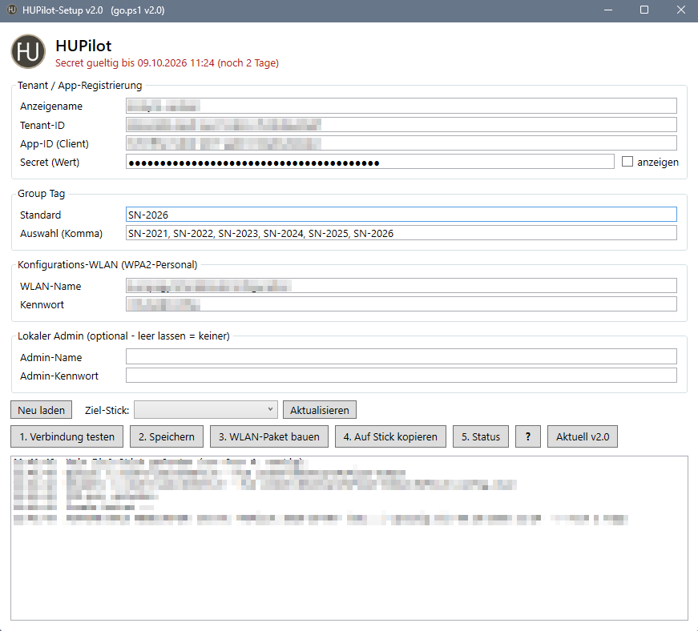

<h1 align="center"> HUPilot</h1>

<b>Windows Autopilot per USB-Stick</b> 
Hash mit Group Tag hochladen, Gerät ohne Hersteller-Programme zurücksetzen – <code>Shift+F10</code> → <code>D:\go</code>.

  
  
  
  

<a href="https://chiliapple.github.io/HUPilot/Stick/HUPilot/Setup/Anleitung.html"><b>Anleitung</b></a> · <a href="INSTALL.md">Installation</a> · <a href="CHANGELOG.md">Änderungen</a> · <a href="LICENSE">Lizenz</a>

---

## Ablauf am Gerät

1. Neues Gerät im ersten Einrichtungsbildschirm, Stick anstecken, **Shift+F10** → `D:\go`
2. Tag wählen (optional Benutzer) und „zurücksetzen ja/nein“ (je 10 s, sonst Standard)
3. Upload → **grün „STICK ABZIEHEN“** → nächstes Gerät
4. Gerät wartet auf das Autopilot-Profil und setzt sich selbst zurück → Autopilot-Anmeldung

| Farbe | Bedeutung |
|---|---|
| Grün | Upload fertig, Stick abziehen |
| Gelb | Netzteil fehlt · kein Profil für den Tag · **Hash gespeichert** (offline, später am PC hochladen) |
| Blau | Zurücksetzen startet |
| Rot | Fehler – **nichts** zurückgesetzt. Nochmal: `D:\go` · Diagnose zum Abfotografieren: `D:\diag` |

## Vorbereitung

1. App-Registrierung `HUPilot-Upload` – [INSTALL.md](INSTALL.md)
2. `Stick\` auf Stick oder in einen Ordner kopieren, **`HUPilot-Setup.cmd`** starten:
   *Verbindung testen* → *Tags prüfen* → *Speichern* → *WLAN-Paket bauen* → *Auf Stick kopieren* (oder *Sticks vorbereiten* für mehrere) · danach *Status* und ggf. *Hashes importieren*

> **Status:** in Erprobung. Upload, Tag-Wechsel, Tag-Prüfung, Offline-Hashes, Zurücksetzen (auch im Akkubetrieb), WLAN-Paket und Autopilot laufen. **Noch nicht auf einem unberührten Neugerät bestätigt:** dass nach dem Zurücksetzen keine Hersteller-Programme zurückkommen.

## Gut zu wissen

- Zurücksetzen ohne Hersteller-Programme: `C:\Recovery\Customizations` wird weggeschoben, dann *Alles entfernen* (RemoteWipe `doWipePersistProvisionedData`). Hersteller-Store-Apps kann Windows trotzdem wiederherstellen.
- **Kein CleanPC-Paket verwenden** – Windows wendet gespeicherte Pakete nach jedem Zurücksetzen erneut an (Endlosschleife).
- Optional lokaler Admin (Kennwort/Konto laufen nie ab) – kommt mit dem WLAN-Paket. Sperrt Intune Bereitstellungspakete (`AllowAddProvisioningPackage`), bleibt am eingerichteten Gerät das vorhandene Paket.
- Kein Internet / Secret abgelaufen → Hash wird am Stick gespeichert und später im Setup hochgeladen. Die Uhrzeit stellt go selbst.
- Setup prüft beim Start online auf neue Versionen (Knopf *Update*).
- Schutz: Gerät mit Benutzerprofil → rote Rückfrage; ohne Netzteil und unter 50 % Akku → wartet.
- Secret kurz gültig halten, Stick nicht aus der Hand geben (`DeviceManagementServiceConfig.ReadWrite.All` gibt es nur mit Schreibrecht).

---

**Lizenz:** kostenlose Nutzung erlaubt, Veränderung und Weitergabe veränderter Fassungen nicht – [LICENSE](LICENSE).
